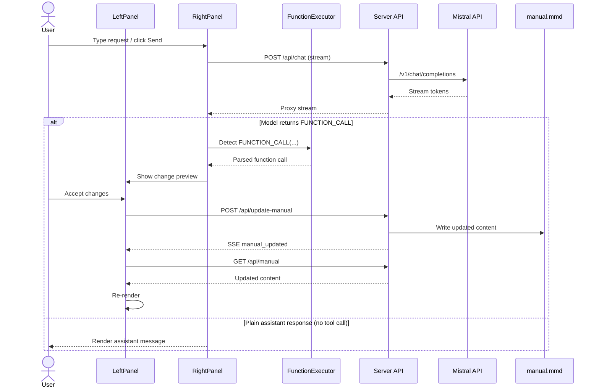
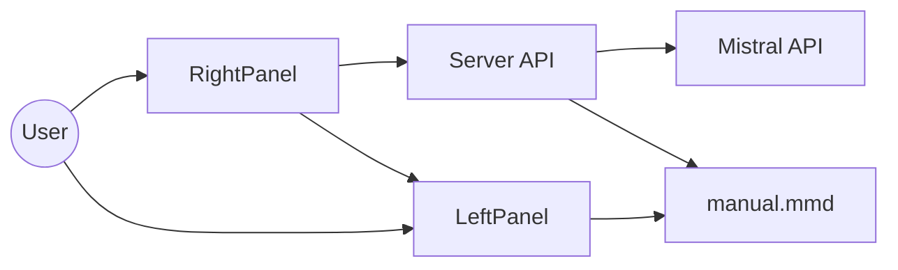

### AI Editor – Split-Pane Markdown + Chat Edits (TS + Vite)

A split-pane web app:
- Left: renders the `manual.mmd` document (Mathpix Markdown + MathJax)
- Right: chat panel to request natural-language edits with preview and undo/redo

### Deployed
- Live app (Railway): [aieditor-production.up.railway.app](https://aieditor-production.up.railway.app/)

### Agentic AI Flow (basic)


### High-Level Architecture


### Quick Start

1) Install
```bash
npm install
```

2) Set API key (server reads `MISTRAL_API_KEY` or `VITE_MISTRAL_API_KEY`)
```bash
export MISTRAL_API_KEY=your_mistral_api_key
```

3) Run dev (starts Vite and API server)
```bash
npm run dev
```
Open `http://localhost:5173` (Vite). The API runs on `http://localhost:3001`.

4) Build + serve (production)
```bash
npm run build
node server.cjs
```
Open `http://localhost:3001` (server serves `dist/`).

### Selection Model

- You select text in the left panel; the app tries to captures the exact raw substring from `manual.mmd`.
- When sending a request, the app includes:
  - The selected text
  - ~10 lines of context before/after (to help the LLM stay precise)
- If no selection exists, the app sends a compact document outline instead. For edits, a selection is required.

### Edit Flow

1) You ask for an edit (e.g., “turn this into a checklist”).
2) The LLM proposes `new_text` for the selected `old_text`.
3) The left panel shows a before/after preview.
4) You Accept (apply) or Discard.
5) Undo/Redo is available for applied changes.

### Safety & Limitations

- Change viewer is not inline; it opens as a modal rather than inline diff.
- Exact text location is not guaranteed; the app guesses where the text occurs in the MD file.
- Applying accepts replaces all instances of `old_text` with `new_text` in the matched region.
- On conflict (multiple matches of the selected text), the server returns 409 and no change is applied.

### Scripts

- `npm run dev` – start Vite (frontend) and API server
- `npm start` – same as dev
- `npm run build` – build frontend to `dist/`
- `npm run preview` – Vite preview server (frontend only)
- `npm run api` – start API server only (`http://localhost:3001`)


## Project Structure

```
├── components/
│   ├── LeftPanel.ts          # Documentation display with context extraction
│   ├── RightPanel.ts         # Chat interface with function calling
│   └── UndoRedoButtons.ts    # Undo/redo functionality
├── services/
│   ├── mistral.ts            # Mistral API integration
│   ├── fileUpdate.ts         # File modification service
│   └── functionExecutor.ts   # LLM function calling system
├── types/
│   └── shared.ts             # Shared interfaces and types
├── utils/
│   └── json.ts               # JSON fixing and parsing utilities
├── index.html
├── main.ts
├── style.css
├── manual.mmd               # Documentation content
└── .env                     # API key configuration (create this)
```

## Development

- Lint & format:
  ```bash
  nvm use 20
  npm run lint
  npm run format
  ```

- Start dev servers (Vite + API):
  ```bash
  npm run dev
  ```

## Technologies

- Vite
- TypeScript
- Mistral AI API
- MathJax
- Mathpix Markdown

